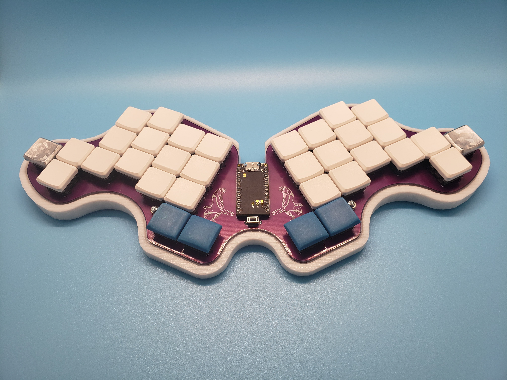
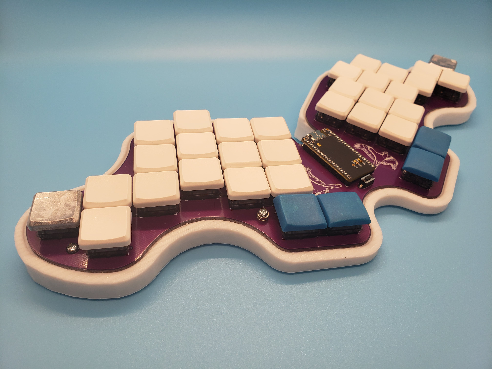
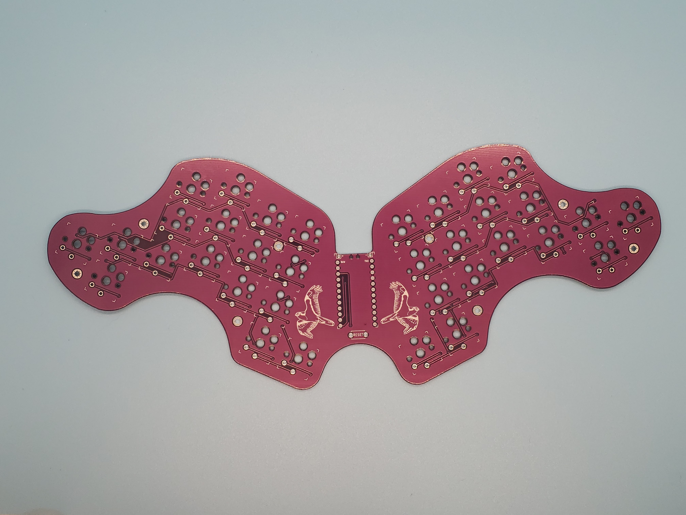

The Osprette
============

This repo contains design files for the PCB and case of my variation on Brow's
[Balbuzard][balbuzard]. The keyboard is a 34 key unibody that uses any pro-micro
compatible daughterboard. It comes with bluetooth support by way of battery
terminals and a power switch.

# Pictures

# Inspiration

I am a big fan of the [Balbuzard][balbuzard], especially the secret choc version that
Brow sent to me. However, there were some things I wanted to change:

- The halves are too close together: not by much, but a little extra space helps a lot
- The thumbs are uncomfortable: normal choc V1 keycaps have ridges on the edges, so the sideways thumbs hurt after prolonged use
- There are too many keys: I've been using 34 keys happily for a while and don't need the other 4 thumb keys
- Not-aggressive pinky stagger: The pinkies on the original are very Corne staggered, which is fine, but I've been spoiled lately by more comfortable, radical stagger
- No support for a power switch: bluetooth is great when you can afford a compatible MCU, and I wanna throw this thing in a bag without worrying about keypresses

All these things together make this board my next step in pursuing the best 34-key
keeb with comfortable pinkies.

# Ordering One

To order one of these from JLC, just upload the `osprette.zip` archive in the
`pcb` directory to the Order Now page at jlcpcb.com, and make sure to set a 1.6mm
thickness.

[balbuzard]: https://github.com/brow/balbuzard
